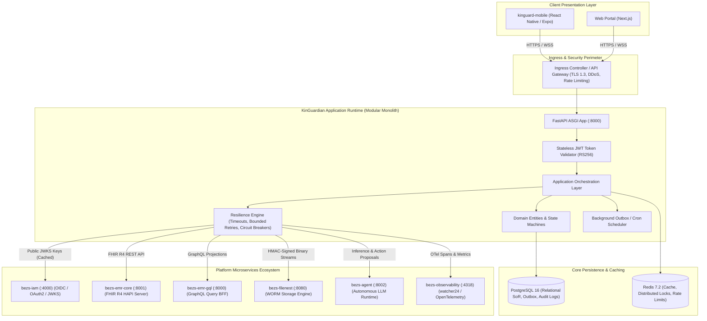
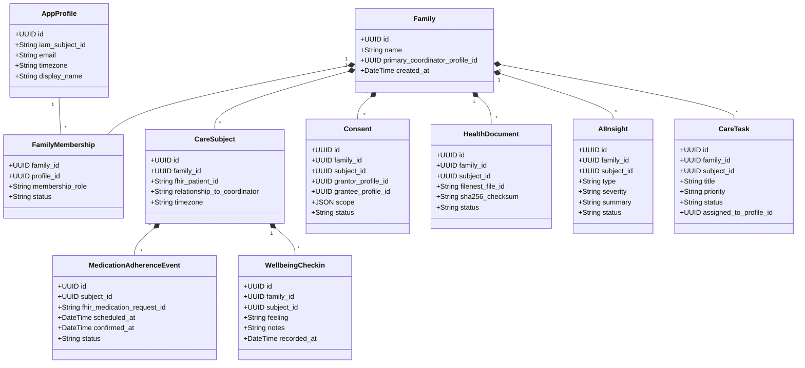
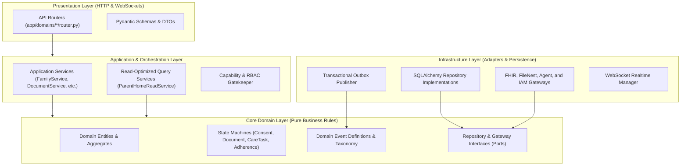
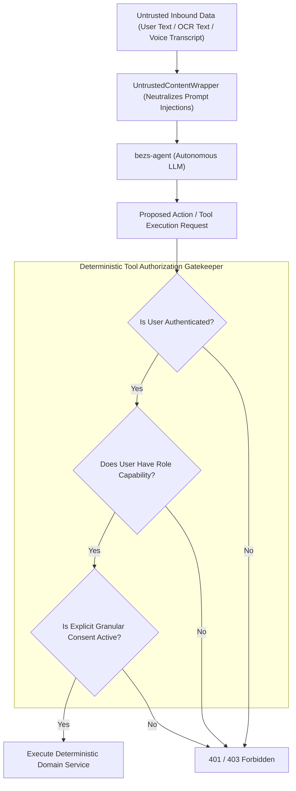
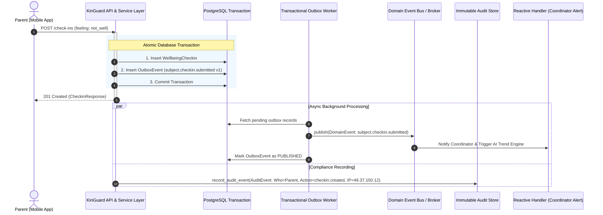

# KinGuardian Platform Architecture & System Design

## 1. Final Architectural Principle & System Topology

KinGuardian is the **Family Health Intelligence and Coordination Layer** that sits at the center of the healthcare ecosystem, backed by specialized infrastructure layers:

- **KinGuardian**: **Family Intelligence & Coordination Layer** (owns the **Family Care Graph**, contextual baselines, Guardian Moments, and task routing).
- **Open Wearables**: **Wearable Connectivity & Normalization Layer** (vendor OAuth, device streams, unit/timestamp normalization).
- **FHIR R4 (`bezs-emr-core`)**: **Clinical Record Layer** (authoritative EMR system of record).
- **FileNest (`bezs-filenest`)**: **Document Layer** (immutable WORM storage, SHA-256 integrity, lab scans).
- **bezs-agent**: **AI / Agent Layer** (autonomous LLM runtime, clinical tooling, and empathetic synthesis).
- **bezs-iam**: **Identity & Authorization Foundation** (OIDC, OAuth2, RS256 JWKS, session tokens).

### The Platform Layer Breakdown

```
                        KinGuardian
                    Family Health Layer
                         │
       ┌─────────────────┼──────────────────┐
       │                 │                  │
       ▼                 ▼                  ▼
   Clinical           Wearable              AI
   Records             Data              Intelligence
       │                 │                  │
       ▼                 ▼                  ▼
   FHIR R4       Open Wearables         bezs-agent
       │                 │                  │
       └─────────────────┼──────────────────┘
                         │
                         ▼
                  Family Care Graph
                         │
       ┌─────────────────┼─────────────────┐
       ▼                 ▼                 ▼
    Parents          Caregivers         Children
     India            India             Abroad
```

### The Family Care Graph Invariant

The **Family Care Graph** is the core KinGuardian-owned aggregate tying the entire ecosystem together:
- **Evidence vs Decision Ownership**: Open Wearables provides the raw/normalized wearable evidence; KinGuardian's Family Care Graph decides:
  1. **Which parent it belongs to** (CareSubject identity mapping and device source tracking).
  2. **Who is permitted to see it** (Granular consent grants and RBAC scope gates).
  3. **What changed** (Deterministic rolling baselines and metric comparisons).
  4. **Whether it matters** (Insight engine, multi-source correlation, and non-alarmist Guardian Moments).
  5. **What action should follow** (Care tasks, check-in prompts, follow-ups, and notifications).

---

## 2. Deployment Architecture



---

## 3. Domain Model & Bounded Contexts



---

## 4. Internal Layered Dependency Graph

KinGuard enforces **Clean Architecture** with strict inward dependency flows:



---

## 5. Authoritative Data Ownership & System of Record (SoR)

To eliminate distributed race conditions and synchronization drifts, **every data field has exactly one authoritative owner**:

| Domain Concept | Authoritative Owner | System of Record | Anti-Duplication Rule |
| :--- | :--- | :--- | :--- |
| **Medication Prescriptions & Dose** | **FHIR / EMR** | `MedicationRequest`, `MedicationStatement` | KinGuard holds only external reference pointers (`fhir_medication_request_id`). No parallel prescription catalog is stored in KinGuard SQL. |
| **Medication Adherence Tracking** | **KinGuard** | `medication_adherence_events` | KinGuard is the single authoritative source of truth for dosage confirmations, dual-timezone timestamps, and adherence metrics. |
| **Parent & Care Circle Hierarchy** | **KinGuard** | `care_subjects`, `family_memberships`, `care_relationships` | Family groupings, member roles, and caregiver delegations are exclusively managed by KinGuard. |
| **Patient Identity & Demographics** | **FHIR + IAM Linkage** | `Patient` resource + IAM `sub` | Clinical demographics originate in FHIR; KinGuard maintains linkage (`care_subjects.fhir_patient_id`). |
| **File Binary Storage** | **FileNest** | WORM Storage Chunks | Raw PDF/image bytes are stored in FileNest; KinGuard stores only metadata pointers (`health_documents.filenest_file_id`, `sha256_checksum`). |
| **AI Conversational Session** | **bezs-agent** | LLM Context & Scratchpads | Intermediate LLM prompt windows are owned by `bezs-agent`; KinGuard stores session pointers (`ai_conversations.agent_session_id`). |
| **AI Insight Application Metadata** | **KinGuard** | `ai_insights`, `ai_actions`, `care_tasks` | Clinical insight metadata, severity, human-in-the-loop approvals, and care task state transitions are strictly owned by KinGuard. |

---

## 6. Security Boundaries & Threat Mitigation Matrix



### Security Controls Breakdown:
1. **Identity & Auth Boundary**: Stateless RS256 JWKS validation against `bezs-iam`. Passwords and credentials never touch KinGuard.
2. **Access Control Matrix**: Fine-grained role capabilities (`coordinator`, `parent`, `caregiver`, `doctor`, `admin`) validated before service execution.
3. **PHI Perimeter & Consent Verification**: Every health data read or document extraction strictly checks active, unexpired `Consent` records (`grantor -> grantee`).
4. **Untrusted LLM Input Neutralization**: Inbound transcripts, OCR strings, and user messages are encapsulated in `<untrusted_user_text>` wrappers to prevent indirect prompt injection.
5. **No Blind Database Execution**: Agent tools in `ControlledToolRegistry` are read-only or parameter-checked; arbitrary SQL or administrative DB access is strictly prohibited.

---

## 7. Event Architecture & Versioning



### Canonical Event Taxonomy:
- `family.created`
- `family.member.added`
- `care.relationship.created`
- `subject.checkin.submitted`
- `medication.taken`
- `medication.missed`
- `document.uploaded`
- `document.processed`
- `appointment.preparation.created`
- `insight.generated`
- `guardian.moment.created`
- `care.task.created`
- `care.task.completed`
- `notification.created`

### Event Versioning Contract:
Every event envelope strictly includes:
- `event_type: str`
- `event_version: int`
- `event_id: UUID` (idempotency key)
- `occurred_at: datetime` (UTC)
- `payload: Dict[str, Any]` (validated against `EventSchemaRegistry`)
