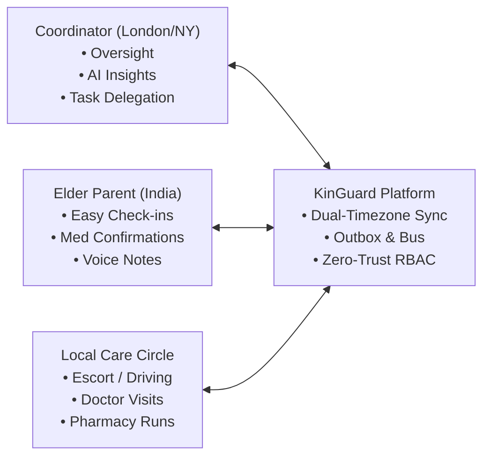
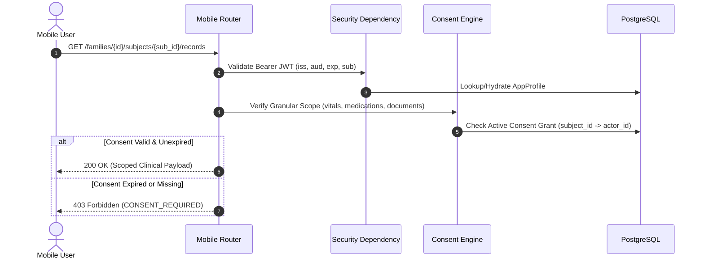

# KinGuard Healthcare Platform — Deep-Dive Architecture & Implementation Guide

## Table of Contents
1. [Platform Vision & Core Purpose](#1-platform-vision--core-purpose)
2. [High-Level Hexagonal Architecture](#2-high-level-hexagonal-architecture)
3. [Domain Models & Database Ownership](#3-domain-models--database-ownership)
4. [Platform Reuse & Anti-Duplication Rule](#4-platform-reuse--anti-duplication-rule)
5. [Security, Zero-Trust IAM & Granular Consent](#5-security-zero-trust-iam--granular-consent)
6. [Cross-Border Dual-Timezone Synchronization](#6-cross-border-dual-timezone-synchronization)
7. [AI Guardian Architecture & Context Minimization](#7-ai-guardian-architecture--context-minimization)
8. [Transactional Outbox & Event-Driven Realtime](#8-transactional-outbox--event-driven-realtime)
9. [Operational Resilience & Production Hardening](#9-operational-resilience--production-hardening)
10. [Mobile Read Model Projections & Single-Roundtrip API](#10-mobile-read-model-projections--single-roundtrip-api)
11. [Developer Onboarding & Local Setup Guide](#11-developer-onboarding--local-setup-guide)

---

## 1. Platform Vision & Core Purpose

KinGuard is an enterprise two-sided cross-border eldercare coordination platform connecting **Expatriate Coordinators** (e.g. Anjali in London / New York) with **Elderly Parents** (e.g. Ramesh in Chennai / Bengaluru) and local care circles (doctors, family caregivers, drivers, nurses).

Unlike generic CRUD apps, KinGuard enforces strict medical data ownership, deterministic medication adherence workflows, autonomous AI health pattern synthesis with human-in-the-loop safety approvals, and sub-millisecond mobile dashboard performance.



---

## 2. High-Level Hexagonal Architecture

KinGuard follows Ports & Adapters (Hexagonal Architecture):
- **Presentation Layer (Inbound Adapters)**: FastAPI routers for mobile REST, WebSocket channels, and SSE event streams.
- **Application Layer**: Use cases, transactional command handlers, and high-performance read-model projections.
- **Domain Layer**: Core aggregates, business entities, value objects, domain events, and port interfaces.
- **Infrastructure Layer (Outbound Adapters)**: PostgreSQL repositories via SQLAlchemy, Redis caching, FHIR EMR client, FileNest object store client, and AI agent facade.

```
Presentation (FastAPI Routers)
       │
       ▼
Application (Use Cases & Read Services)
       │
       ▼
Domain (Entities, Events, Interfaces)
       │
       ▼
Infrastructure (PostgreSQL, Redis, Adapters)
```

---

## 3. Domain Models & Database Ownership

| Entity | Primary Table | Purpose & Ownership |
| :--- | :--- | :--- |
| `AppProfile` | `app_profiles` | Local user context hydrated from `bezs-iam` JWT tokens. Stores name, timezone, email. |
| `Family` | `families` | Multi-tenant Care Circle boundary containing members, subjects, and tasks. |
| `CareSubject` | `care_subjects` | Care recipient (e.g. Dad/Mom) linked to an external FHIR Patient record (`fhir_patient_id`). |
| `Consent` | `consents` | Explicit granular permissions granted by patients to coordinators for specific data scopes. |
| `CareTask` | `care_tasks` | Actionable care duties with priority, due date, category, and assigned caregiver. |
| `MedicationAdherenceEvent` | `medication_adherence_events` | Adherence tracking records (taken, missed, delayed) referencing FHIR `MedicationRequest`. |
| `WellbeingCheckin` | `wellbeing_checkins` | Daily self-reported feeling (`great`, `good`, `okay`, `not_well`), notes, and audio files. |
| `AIInsight` | `ai_insights` | Guardian Moments and trend insights synthesized across longitudinal clinical data. |
| `HealthDocument` | `health_documents` | FileNest-backed medical records, prescriptions, and lab reports with OCR status. |
| `OutboxEvent` | `outbox_events` | Transactional outbox table ensuring zero message loss with exponential backoff. |
| `EventLog` | `event_logs` | Immutable audit log capturing dual-timezone timestamps for compliance and forensics. |

---

## 4. Platform Reuse & Anti-Duplication Rule

KinGuard adheres to the platform reuse matrix:
1. **Clinical Data**: KinGuard does not maintain duplicate clinical tables (`Observation`, `Condition`, `DiagnosticReport`). All clinical facts are fetched from `bezs-emr-gql` via `ClinicalGateway`.
2. **Identity**: KinGuard does not store passwords or issue authentication tokens. All auth handoffs use `bezs-iam`.
3. **File Storage**: KinGuard does not store binaries on disk or S3 directly. File ingestion is mediated through signed pre-signed URLs from `FileNest`.
4. **AI Reasoning**: KinGuard delegates LLM tool invocation and synthesis to `bezs-agent`.

---

## 5. Security, Zero-Trust IAM & Granular Consent



---

## 6. Cross-Border Dual-Timezone Synchronization

Every domain event recorded by `EventService` calculates both timezone representations simultaneously:
- **Parent Local Time**: Evaluated using the parent's timezone (e.g. `Asia/Kolkata` -> `2026-08-27 07:30:00 IST`).
- **Coordinator Local Time**: Evaluated using the coordinator's timezone (e.g. `Europe/London` -> `2026-08-27 02:00:00 BST`).

This guarantees coordinators always understand when their parents completed morning routines without timezone calculation errors.

---

## 7. AI Guardian Architecture & Context Minimization

The `AIContextBuilder` executes **Zero-Trust Context Minimization**:
1. It validates active patient consent.
2. It fetches only the strictly necessary clinical data window (last 7–14 days).
3. It sanitizes and redacts unrelated PHI.
4. It supplies 12 isolated, permission-gated safe tools (`get_medications`, `list_checkins`, `propose_task`, `prepare_appointment`).
5. Any clinical intervention or medication alteration requires explicit human coordinator confirmation (`AIAction.requires_approval == True`).

---

## 8. Transactional Outbox & Event-Driven Realtime

To eliminate distributed 2-phase commit inconsistencies:
1. Business entity state change and `OutboxEvent` are written inside the **same database transaction**.
2. If the database transaction rolls back, no event is ever published.
3. Background outbox worker fetches pending events (`available_at <= now()`) and publishes them to the in-memory/RabbitMQ bus.
4. Failures trigger exponential backoff retry:
   $$\text{retry\_delay} = \text{backoff\_seconds} \times 2^{\text{attempt} - 1}$$
5. Consumers use unique idempotency keys (`event_id`) to prevent duplicate execution.

---

## 9. Operational Resilience & Production Hardening

- **Sliding-Window Rate Limiting**: Multi-tier rate limiting via `TieredRateLimiter` (Auth Handoff: 20 req/min, AI: 30 req/min, Docs: 30 req/min, Messaging: 60 req/min).
- **Circuit Breakers**: External dependencies (FHIR EMR, FileNest, bezs-agent) are guarded by `CircuitBreaker` (`CLOSED` -> `OPEN` on 5 consecutive failures, fast-failing to cached/degraded fallbacks).
- **Zero-Trust PHI Redaction**: All structured JSON logs automatically sanitize sensitive fields (`blood_pressure`, `glucose`, `password`, `jwt`, `ocr_payload`, `raw_content`) to `[REDACTED]`.
- **Telemetry**: Prometheus `/metrics` endpoint exports HTTP request rates, latency histograms, and outbox queue depth.

---

## 10. Mobile Read Model Projections & Single-Roundtrip API

To avoid mobile "chattiness" over high-latency cross-border cellular networks, KinGuard provides optimized read models:
- **`CoordinatorHomeResponse`**: Returns care recipient status, today's medications, upcoming appointments, pending care tasks, active Guardian Moments, and recent timeline updates in **one HTTP GET request**.
- **`ParentHomeResponse`**: Returns today's checkin status, active medication dose checklist, and next upcoming visit for elder-friendly touch screens.
- **`ParentHealthSummaryResponse`**: Multi-week vitals trends, adherence percentage, and historical check-in notes.

---

## 11. Developer Onboarding & Local Setup Guide

```bash
# 1. Clone the repository and enter the backend
cd platform/kinguard-backend

# 2. Synchronize Python virtual environment
uv sync

# 3. Apply database migrations
uv run alembic upgrade head

# 4. Seed demo scenarios and development dataset
uv run python -m app.seeds.development

# 5. Run full test suite
uv run python -m pytest -v

# 6. Start development server
uv run uvicorn app.main:app --host 0.0.0.0 --port 8000 --reload
```
