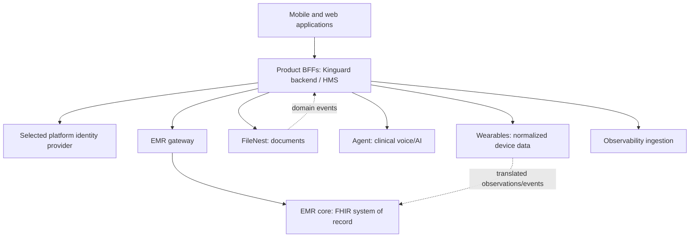

# Architecture Proposal

## Target: modular platform, not a premature merged monolith

Keep the current applications independently deployable. Introduce a thin platform integration layer made of published contracts, generated clients, and a deliberate identity strategy. This achieves reuse while preserving clear data ownership.

## Decisions

| Decision | Proposal | Why | Exit criterion |
|---|---|---|---|
| Service boundaries | Preserve EMR, documents, wearable, agent, family-care, and telemetry ownership | Existing stores and migration systems are separate | No cross-service database credentials in application runtime configs |
| Identity | Run a short discovery, then designate one supported issuer | Three IAM implementations exist; their interchangeability is unproven | Issuer/audience/claim contract, migration plan, and integration tests approved |
| Client reuse | Generate/package language clients from versioned OpenAPI | Avoid copied REST adapters and vendored SDK drift | HMS and mobile/backend use a pinned client package |
| EMR gateway | Keep current REST gateway; make GraphQL a separate, evidence-driven decision | Existing `bezs-emr-gql` is REST and clients already target REST paths | A federated-read use case, schema ownership, and query-cost controls exist |
| Events | Introduce an outbox-to-event contract per owning service | FileNest and Kinguard backend already contain outbox concepts | Named event envelope, idempotency key, retention, and retry policy |
| Shared code | Start with small, versioned libraries for auth validation, API clients, and UI tokens | Root has no Node/Python workspace and projects are independently versioned | First library has consumers, CI, semantic releases, and rollback path |

## Delivery sequence

1. **Baseline (0–2 weeks):** freeze and publish existing API/WS contracts; inventory production URLs and credential boundaries; add dependency health checks.
2. **Stabilize (2–6 weeks):** deliver generated EMR/FileNest/observability clients; replace HMS vendored FileNest copy; introduce contract tests.
3. **Unify safely (6–12 weeks):** choose IAM target and migrate one relying party at a time; introduce durable event envelopes for documents and wearable-to-clinical translation.
4. **Optimize later:** evaluate shared UI workspace, GraphQL read composition, and broker consolidation only with measured operational and product need.

## Explicit non-goals

- No direct cross-service database reads.
- No deletion or consolidation of the existing IAM services before a reversible migration is validated.
- No claim that current REST services are GraphQL solely because of a directory or environment-variable name.
