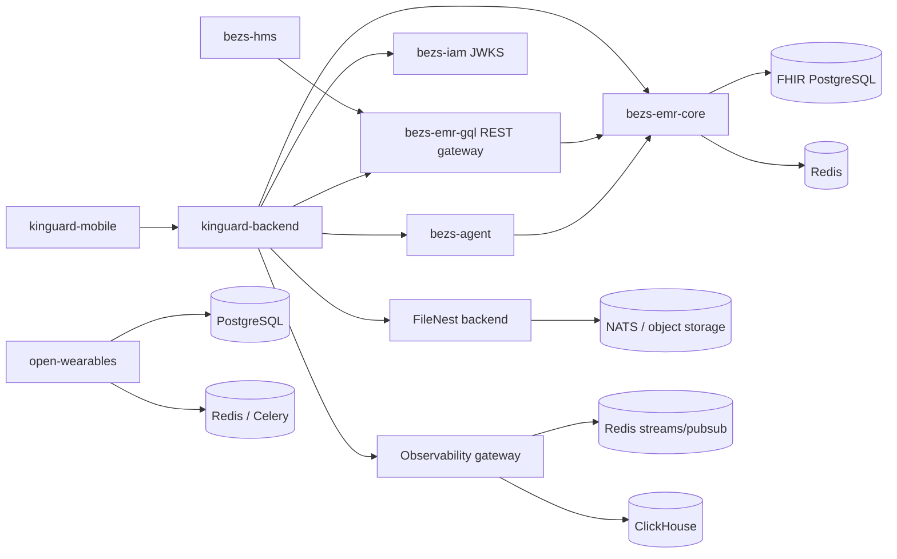

# Dependency Map

## Observed runtime topology

Arrows indicate configured or implemented calls, not proof that every service is deployed together. In particular, the `kinguard-backend` defaults currently point FileNest and agent URLs at the same localhost port, which requires environment-specific override.

## Component inventory

| Component | Runtime | Direct dependencies observed | Persistence / infrastructure |
|---|---|---|---|
| `kinguard-mobile` | Expo / React Native | API endpoints supplied at runtime; Google GenAI package | device storage |
| `kinguard-backend` | FastAPI worker + API | IAM JWKS, FHIR API/gateway, FileNest, agent, observability | PostgreSQL, Redis; Alembic in Compose |
| `bezs-iam` | Next.js / Better Auth / Prisma | PostgreSQL | Prisma database |
| `bezs-hms` | Next.js / Prisma | `FHIR_GQL_URL` REST services | Prisma database |
| `bezs-emr-core` | FastAPI / SQLAlchemy | JWT issuer/JWKS | PostgreSQL, Redis, Alembic |
| `bezs-emr-gql` | FastAPI | EMR server URL, IAM JWKS | Redis; no application database by design |
| `bezs-agent` | FastAPI / WebSockets | FHIR base URL, IAM JWKS, LLM/STT/TTS providers | local session/patient storage and optional MLflow |
| FileNest | FastAPI backend, Next.js IAM/web, SDKs | storage providers and NATS | PostgreSQL, outbox, object storage, NATS |
| `open-wearables` | FastAPI, React, Celery | wearable-provider APIs | PostgreSQL, Redis, Svix |
| Observability | Go gateway/realtime/notifier, Python analytics, Next console | SDK ingestion; IAM database for API-key checks | Redis, ClickHouse, PostgreSQL |
| `bezs-pipeline` | Airflow/Python | source connectors, Elasticsearch/OpenSearch, embedding providers | Airflow metadata DB; target search store |

## Startup implications

1. Start each project’s declared database/broker before its API or worker. Compose files provide the authoritative local ordering.
2. Start an identity provider before services configured with a JWKS URL, then verify issuer/audience compatibility.
3. Start EMR core before `bezs-emr-gql` and before agent EHR features.
4. Start FileNest’s storage and messaging dependencies before enabling document flows in Kinguard backend.
5. Start Observability’s Redis and ClickHouse before gateway/analytics/realtime services.

## Source anchors

- Root development stack: `docker-compose.dev.yml`.
- Kinguard external bindings: `platform/kinguard-backend/app/core/config.py`.
- EMR core datastore requirements: `platform/bezs-emr-core/docker-compose.dev.yml`.
- Gateway resources: `platform/bezs-emr-gql/app/routers/__init__.py`.
- Observability topology: `platform/bezs-observability/apps/*/docs/overview.md`.
