# Integration Map & Protocol Matrix

## Overview
This document specifies the integration protocols, authentication flows, endpoint contracts, resilience configurations, and data boundaries between `kinguardian-backend` and all external services in the `platform/` ecosystem.

---

## 1. Integration Matrix

```mermaid
flowchart TD
    KB["KinGuardian Backend (Modular Monolith)"]
    
    subgraph Identity ["Identity & Access (IAM)"]
        IAM["bezs-iam (OIDC / OAuth2)"]
    end

    subgraph Clinical ["Clinical Record System"]
        EMR_CORE["bezs-emr-core (FHIR R4 REST)"]
        EMR_GQL["bezs-emr-gql (GraphQL Projections)"]
        EMR_MCP["bezs-emr-mcp (MCP Clinical Tools)"]
    end

    subgraph Storage ["Document & Object Storage"]
        FILENEST["bezs-filenest (WORM Storage)"]
    end

    subgraph AI ["AI & Autonomous Agent Runtime"]
        AGENT["bezs-agent (Autonomous LLM)"]
    end

    subgraph Telemetry ["Observability & Metrics"]
        OBS["bezs-observability (watcher24 / OTel)"]
    end

    subgraph Wearables ["IoT / Wearable Metrics"]
        WEAR["open-wearables (Aggregator)"]
    end

    KB -->|"JWKS / Bearer Token Validation"| IAM
    KB -->|"FHIR R4 Queries (/Patient, /MedicationRequest)"| EMR_CORE
    KB -->|"GraphQL Projections (/patients/{id})"| EMR_GQL
    KB -->|"MCP Tools Protocol"| EMR_MCP
    KB -->|"WORM Upload / Pre-signed URL / SHA-256"| FILENEST
    KB -->|"Async Chat / Propose Action / Trend Eval"| AGENT
    KB -->|"OpenTelemetry Spans & Metrics"| OBS
    KB -->|"REST Ingestion (Observations)"| WEAR
```

---

## 2. Service Integration Specifications

### 2.1 Identity & Access Management (`bezs-iam`)
- **Protocol**: HTTP / OIDC (RS256 JWT validation via JWKS endpoint)
- **Base URL Setting**: `IAM_JWKS_URL`, `IAM_ISSUER`, `IAM_AUDIENCE`
- **Integration Mechanism**: Stateless cryptographic token verification in `app/core/security.py`
- **Security Boundary**: KinGuardian validates token signature, issuer, expiration, and extracts `sub` as `iam_subject_id`. Passwords and credentials never touch KinGuardian.
- **Failover / Degradation**: Public keys are cached locally with TTL; requests fail-fast on token expiration (`401 Unauthorized`).

### 2.2 Clinical Record Gateway (`bezs-emr-core` & `bezs-emr-gql`)
- **Protocol**: HTTP REST (FHIR R4 format: `application/fhir+json`) and GraphQL HTTP POST
- **Base URL Setting**: `FHIR_API_URL`, `FHIR_GQL_URL`, `EMR_CORE_URL`, `EMR_GQL_URL`
- **Gateway Adapter**: `FHIRClinicalRecordGateway` (`app/domains/clinical/gateway.py`)
- **Timeouts & Retries**: Connect: 2.0s, Read: 4.0s, Total: 5.0s. Max 3 retries on transient errors with jitter.
- **Circuit Breaker**: `failure_threshold: 4`, `recovery_timeout: 20s`, `half_open_probes: 2`.
- **Degradation Policy**: On outage, returns degraded clinical payload (`ResilientFHIRHandler`) so coordinator dashboard loads family data without throwing 500 errors.

### 2.3 Document Storage Gateway (`bezs-filenest`)
- **Protocol**: HTTP REST with HMAC-SHA256 request signing and dynamic idempotency key (`upload-{sha256}`)
- **Base URL Setting**: `FILENEST_URL`
- **Gateway Adapter**: `FileNestGateway` (`app/core/adapters/prod_filenest.py`)
- **Timeouts & Retries**: Connect: 3.0s, Read: 8.0s, Write: 10.0s, Total: 10.0s. Max 3 retries.
- **Circuit Breaker**: `failure_threshold: 5`, `recovery_timeout: 30s`, `half_open_probes: 2`.
- **Data Boundary**: KinGuardian stores metadata (`filenest_file_id`, `sha256_checksum`, `mime_type`), never raw binary bytes.

### 2.4 Autonomous AI Agent (`bezs-agent`)
- **Protocol**: HTTP REST (`POST /api/v1/agent/chat`, `POST /api/v1/agent/propose-action`) & WebSockets
- **Base URL Setting**: `AGENT_SERVICE_URL`, `AGENT_TIMEOUT` (default: 15.0s)
- **Gateway Adapter**: `AgentGateway` (`app/core/adapters/prod_agent.py`)
- **Timeouts & Retries**: Connect: 3.0s, Read: 12.0s, Total: 15.0s. 2 bounded attempts on transient network errors. Non-idempotent mutations are never retried blindly.
- **Circuit Breaker**: `failure_threshold: 3`, `recovery_timeout: 15s`, `half_open_probes: 1`.
- **Degradation Policy**: When breaker is OPEN or LLM fails, returns safe fallback insight: *"KinGuardian couldn't generate the insight right now. You can review the underlying health information."*

### 2.6 Wearable Aggregation Platform (`open-wearables`)
- **Protocol**: HTTP REST API (`/v1/users`, `/v1/connections`, `/v1/metrics`) & Inbound HMAC Webhooks
- **Base URL Setting**: `OPEN_WEARABLES_BASE_URL`, `OPEN_WEARABLES_API_KEY` (SecretStr)
- **Gateway Adapter**: `OpenWearablesGateway` / `MockWearableDataGateway` (`app/domains/wearables/gateway.py`)
- **Database Catalog Isolation**: Uses independent `open_wearables_db` PostgreSQL catalog.
- **Failover / Error Boundary**: On provider outage, returns sanitized `WEARABLE_SERVICE_UNAVAILABLE` with message: *"We couldn't update your health data right now. Your connection is still intact."*

### 2.7 Ingestion & ETL Pipelines (`bezs-pipeline`)
- **Protocol**: Pipeline Connectors / Extractors / Transformers / Loaders
- **Integration Mechanism**: Internal transformation engine for bulk telemetry and EHR legacy imports. Writes clinical records solely through owner REST APIs.

### 2.8 Clinical Application Surface (`bezs-hms`)
- **Protocol**: Next.js / React Hospital Portal
- **Integration Mechanism**: Interacts with `bezs-emr-core`, `bezs-filenest`, and `bezs-iam` for hospital staff, physician, and administrative UI workflows.

---

## 3. Communication Channels & Protocols Summary

| Service | Target Port / Protocol | Architectural Domain | Auth Method | Idempotency Header | Fallback Strategy |
| :--- | :--- | :--- | :--- | :--- | :--- |
| **`bezs-iam`** | `4000/http` | **identity/auth** | RS256 JWKS | N/A (Read-only) | Cached JWKS public key set |
| **`bezs-emr-core`** | `8001/http` | **FHIR clinical record** | Bearer Token | `Idempotency-Key` on mutations | Degraded in-memory clinical stub |
| **`bezs-emr-gql`** | `8000/http` | **clinical orchestration** | Bearer Token | N/A (Read projections) | Cached subject timeline |
| **`bezs-emr-mcp`** | `8003/stdio/http` | **clinical agent tools** | MCP Protocol Token | Parameter Validation | Tool execution error rejection |
| **`bezs-agent`** | `8002/http` | **AI runtime** | Bearer Token | N/A (Guarded non-idempotent) | Safe fallback insight message |
| **`bezs-filenest`** | `8080/http` | **health documents** | HMAC API Key | `Idempotency-Key: upload-{sha256}` | Fast-fail with retry guidance |
| **`bezs-pipeline`** | Ingestion library | **ingestion/ETL** | Internal worker auth | Batch checkpointing | Dead letter queue & retry |
| **`bezs-observability`** | `4318/http` (OTLP) | **telemetry/audit** | Service Secret | N/A | Non-blocking drop on buffer full |
| **`open-wearables`** | `8004/http` | **wearable aggregation** | Service API Key + HMAC | Webhook Event ID deduplication | Sanitized `WEARABLE_SERVICE_UNAVAILABLE` |
| **`bezs-hms`** | `3000/http` | **clinical application surface** | IAM Session / Better Auth | Form submission CSRF / Idempotency | User-friendly reload toast |

