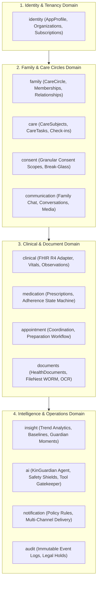
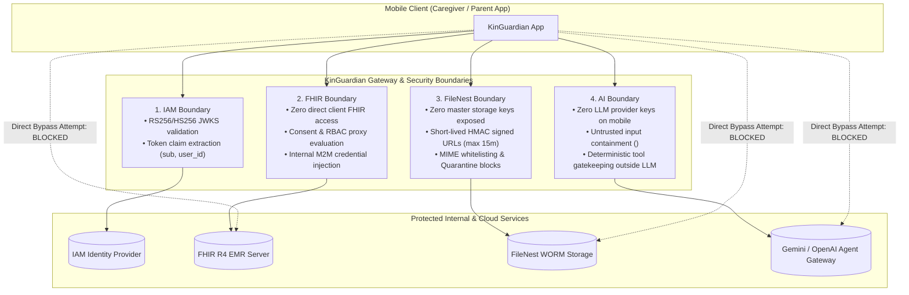
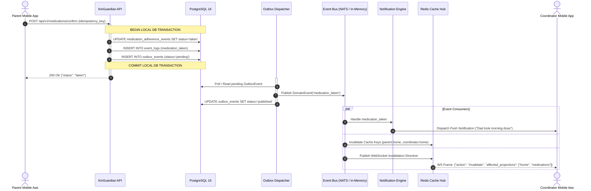
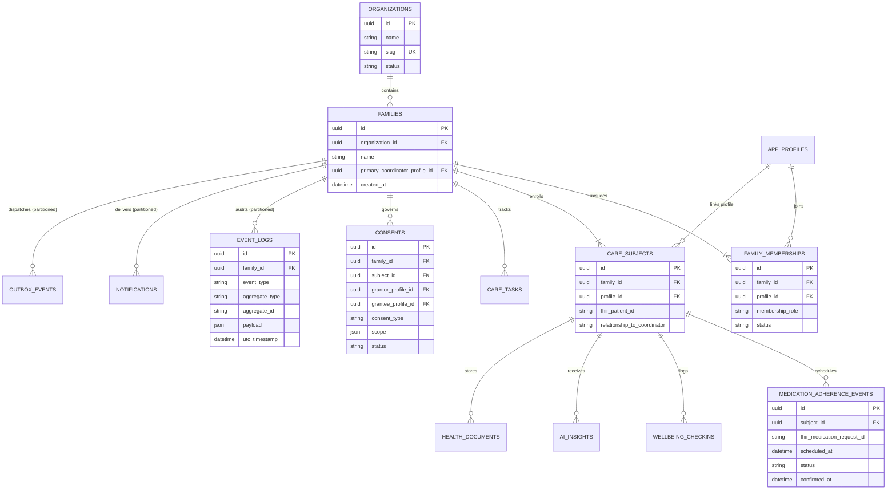
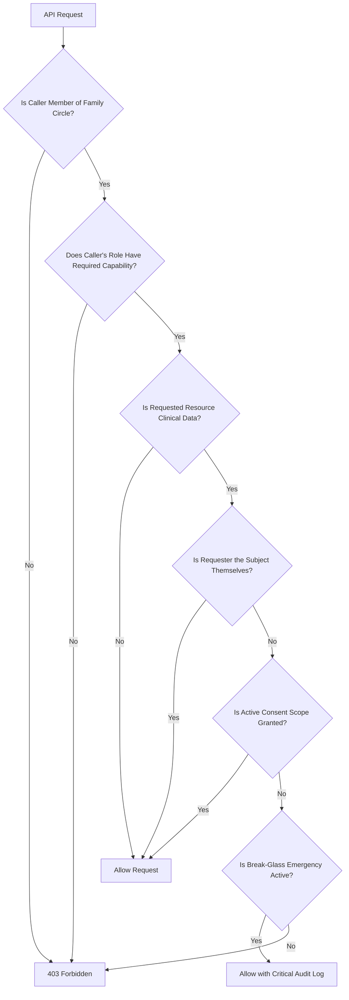
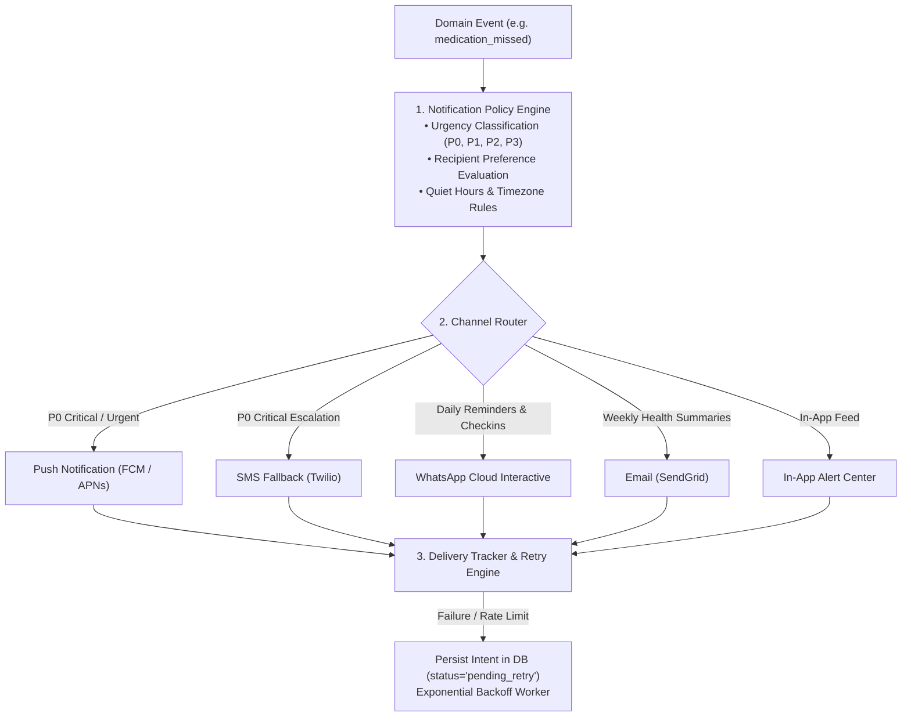

# KinGuardian Platform Architecture Specification

This document provides the definitive architectural specification for the **KinGuardian Platform Backend**, detailing system context, bounded domains, data ownership, security boundaries, event-driven choreography, database schemas, authorization models, and notification pipelines.

---

## 1. System Context Diagram (C4 Level 1 & 2)

```mermaid
C4Context
    title KinGuardian Platform - System Context & Container Diagram

    Person(caregiver, "Care Coordinator / Adult Child", "Monitors aging parents, manages tasks, coordinates appointments, receives Guardian Moments.")
    Person(parent, "Aging Parent / Care Subject", "Logs daily check-ins, confirms medication doses, views care circle updates.")
    Person(clinician, "Attending Physician / Doctor", "Reviews appointment summaries, clinical trends, and historical records.")

    System_Boundary(kinguardian_boundary, "KinGuardian Core Platform (Modular Monolith)") {
        Container(api_gateway, "API & Realtime Gateway", "FastAPI, WebSockets, SSE", "Handles mobile/web ingress, JWT authentication, rate limiting, and projection invalidations.")
        Container(domain_modules, "Domain Modules (13 Bounded Contexts)", "Python 3.12, Clean Architecture", "Executes business logic, domain state machines, and use cases.")
        Container(event_engine, "Event Choreography & Outbox Engine", "NATS JetStream / In-Memory Bus", "Guarantees reliable cross-domain event dispatch and distributed sagas.")
        ContainerDb(postgres_db, "PostgreSQL 16 Database", "PostgreSQL + pgvector", "Primary relational store with row-level tenancy and monthly range partitioning.")
        ContainerDb(redis_cache, "Redis 7 Cache & Realtime Hub", "Redis Cluster", "Query cache, WebSocket connection registry, and idempotency store.")
    }

    System_Ext(iam_service, "IAM Identity Service", "JWKS / OAuth2 / OIDC", "Issues user access tokens and handles credential authentication.")
    System_Ext(fhir_service, "FHIR R4 EMR Service", "HAPI FHIR / Hospital EMR", "Stores and serves clinical resources (Observations, Medications, Appointments).")
    System_Ext(filenest_service, "FileNest Object Store", "WORM Compliant S3/Blob Storage", "Stores immutable medical PDFs, discharge summaries, and diagnostic scans.")
    System_Ext(agent_runtime, "KinGuardian Agent / LLM Gateway", "Gemini Pro / OpenAI / Claude", "Generates clinical summaries, trend insights, and appointment preparation briefs.")
    System_Ext(notif_providers, "Notification Providers", "FCM, Twilio, WhatsApp Cloud, SendGrid", "Multi-channel message delivery network.")
    System_Ext(wearables_feed, "Global Wearables & Labs", "Apple Health, Fitbit, Garmin, Oura, Lal PathLabs", "Wearable and diagnostic telemetry pipelines.")

    Rel(caregiver, api_gateway, "Uses Mobile App / Web", "HTTPS / WSS / Bearer JWT")
    Rel(parent, api_gateway, "Uses Mobile App / WhatsApp", "HTTPS / WSS / WhatsApp Webhook")
    Rel(clinician, api_gateway, "Views Prepared Summaries", "HTTPS / SMART on FHIR")

    Rel(api_gateway, domain_modules, "Invokes Use Cases", "In-Process Clean Architecture Calls")
    Rel(domain_modules, event_engine, "Publishes Domain Events", "Outbox / Async Bus")
    Rel(domain_modules, postgres_db, "Reads / Writes State", "SQLAlchemy 2.0 AsyncPG")
    Rel(domain_modules, redis_cache, "Caches Projections & Locks", "Redis Protocol")

    Rel(api_gateway, iam_service, "Validates JWKS Signatures", "HTTPS / JWKS")
    Rel(domain_modules, fhir_service, "Proxies Authorized Clinical Data", "HTTPS / M2M Internal Auth")
    Rel(domain_modules, filenest_service, "Generates Signed URLs", "HTTPS / HMAC-SHA256")
    Rel(domain_modules, agent_runtime, "Executes Guarded Prompts", "HTTPS / Server-Side API Key")
    Rel(event_engine, notif_providers, "Dispatches Multi-Channel Alerts", "HTTPS / Webhooks")
    Rel(wearables_feed, domain_modules, "Pushes Normalized Telemetry", "HTTPS Ingestion Pipeline")
```

---

## 2. Bounded Domain Contexts

The modular monolith is structured into **13 discrete bounded contexts** organized into 4 strict clean-architecture layers:

### Clean Architecture Layering Rules:
1. **Domain Layer (`domain/`)**: Pure business entities, value objects, domain exceptions, and state machine transitions. Zero dependencies on database or web frameworks.
2. **Application Layer (`application/`)**: Explicit use cases, application services, permission verifiers, and transaction coordinators.
3. **Infrastructure Layer (`infrastructure/`)**: SQLAlchemy ORM models, repository implementations with `selectinload`, and external gateway adapters.
4. **Presentation Layer (`presentation/`)**: FastAPI routers, Pydantic v2 DTO schemas, and WebSocket/SSE endpoints.

---

## 3. Data Ownership Matrix

Each database table is exclusively owned by a single domain module. Cross-domain data access occurs **only** through domain repository protocols or asynchronous domain events—direct foreign table joins across domain boundaries are forbidden.

| Domain Module | Primary Tables Owned | Entity Types | Access Policy for Other Domains |
| :--- | :--- | :--- | :--- |
| **`identity`** | `app_profiles`, `organizations` | `AppProfileEntity`, `OrganizationEntity` | Read-only via `IAppProfileRepository`. |
| **`family`** | `families`, `family_memberships`, `family_relationships` | `FamilyEntity`, `FamilyMembershipEntity` | Read/Write via `IFamilyRepository`. |
| **`care`** | `care_subjects`, `care_relationships`, `care_tasks`, `wellbeing_checkins` | `CareSubjectEntity`, `CareTaskEntity`, `WellbeingCheckinEntity` | Managed via `FamilyService`. |
| **`consent`** | `consents` | `ConsentEntity` | Evaluated via `IConsentRepository` & `PermissionVerifier`. |
| **`medication`**| `medication_adherence_events` | `MedicationAdherenceEventEntity` | Mutated via `ConfirmMedicationUseCase`. |
| **`appointment`**| `appointment_coordinations` | `AppointmentCoordinationEntity` | Managed via `AppointmentPreparationWorkflow`. |
| **`documents`** | `health_documents`, `document_extractions` | `HealthDocumentEntity`, `DocumentExtractionEntity` | Controlled via `FileSecurityBoundary`. |
| **`communication`**| `family_conversations`, `family_messages` | `FamilyConversationEntity`, `FamilyMessageEntity` | Accessed via `ConversationsRouter`. |
| **`insight`** | `ai_insights`, `ai_insight_sources`, `monitoring_preferences` | `AIInsightEntity`, `MonitoringPreferenceEntity` | Generated by `TrendAnalyticsEngine`. |
| **`ai`** | `agent_interactions`, `ai_actions`, `ai_conversations` | `AgentInteractionEntity`, `AIActionEntity` | Guarded via `AISecurityBoundary`. |
| **`notification`**| `notifications`, `notification_deliveries` | `NotificationEntity`, `NotificationDeliveryEntity` | Dispatched via `NotificationService`. |
| **`audit`** | `event_logs`, `outbox_events` | `EventLogEntity`, `OutboxEventEntity` | Append-only via `EventService` & `OutboxService`. |

---

## 4. Security Boundaries

### A. IAM Boundary
- Validates cryptographic JWT signatures against the identity provider JWKS endpoint.
- Maps the external identity `sub` claim to internal `AppProfile.id`.
- Rejects unauthenticated requests with **HTTP 401 Unauthorized**.

### B. FHIR Security Boundary
- Mobile clients never communicate directly with the FHIR R4 server.
- All clinical queries (`/api/v1/clinical/*`) require active parent consent (`ConsentType.CLINICAL_READ` with `vitals`/`medications` flags).
- Server translates `(requester_id, subject_id)` $\to$ `fhir_patient_id` and executes authenticated internal M2M queries.
- Direct bypass attempts or missing consent requests return **HTTP 403 Forbidden**.

### C. FileNest Security Boundary
- Master storage credentials (`FILENEST_API_KEY`, S3 access/secret keys) are never transmitted to clients.
- Uploads and downloads use short-lived (max 900s TTL) HMAC-SHA256 signed URLs.
- MIME type whitelist enforces clinical formats (`.pdf`, `.png`, `.jpeg`, `.webp`, `.heic`).
- Executable files and quarantined files (failing antivirus scans) are blocked.

### D. AI Security Boundary
- Zero model-provider API keys are exposed to mobile clients.
- User text, OCR outputs, and voice transcripts are treated as untrusted and wrapped in `<untrusted_user_text>` tags.
- Tool requests from the LLM are evaluated deterministically by [`ExternalToolAuthorizationGatekeeper`](file:///d:/Kalyan/kinguardian-platform/platform/kinguardian-backend/app/domains/agent/safety.py) strictly outside the model.
- High-risk clinical actions enforce a Human-in-the-Loop approval workflow (`status="awaiting_approval"`).

---

## 5. Event Flow & Transactional Outbox Pattern

### Distributed Sagas & Compensating Actions
To ensure resilience without 2-Phase Commit (2PC) across PostgreSQL, FHIR, FileNest, and Notification providers:
1. Core state and outbox events commit in a **Local DB Transaction**.
2. Asynchronous workers attempt downstream delivery with exponential backoff (up to 5 retries).
3. If an external system rejects the payload permanently (e.g. invalid FHIR schema), [`CompensatingActionEngine`](file:///d:/Kalyan/kinguardian-platform/platform/kinguardian-backend/app/core/transaction_boundary/saga.py) executes compensation logic, transitions the entity to `sync_failed`, logs `audit.compensating_action_executed`, and marks the outbox event as `compensated_failure`.

---

## 6. Database Schema & Multi-Tenancy Architecture

### High-Volume Monthly Range Table Partitioning
The following append-only tables are partitioned monthly by timestamp (`TablePartitionManager`):
- `event_logs`
- `outbox_events`
- `notifications` & `notification_deliveries`
- `medication_adherence_events`
- `wellbeing_checkins`

---

## 7. Authorization Model & Capabilities Matrix

KinGuardian enforces a 2-tier security model: **RBAC Role Capabilities** + **Explicit Consent Grants**.

### Role Capabilities Matrix

| Capability Name | Primary Coordinator | Care Coordinator | Aging Parent | Family Member / Viewer |
| :--- | :---: | :---: | :---: | :---: |
| `manage_circle` | ✅ | ❌ | ❌ | ❌ |
| `invite_members` | ✅ | ✅ | ❌ | ❌ |
| `assign_care_tasks` | ✅ | ✅ | ❌ | ❌ |
| `view_timeline` | ✅ | ✅ | ✅ | ✅ (Consented) |
| `log_wellbeing_checkin` | ✅ | ✅ | ✅ | ❌ |
| `confirm_medication` | ✅ | ✅ | ✅ | ❌ |
| `grant_revoke_consent` | ❌ | ❌ | ✅ | ❌ |
| `view_clinical_vitals` | ✅ (Consented) | ✅ (Consented) | ✅ | ❌ |
| `execute_ai_agent` | ✅ | ✅ | ✅ | ❌ |

---

## 8. Multi-Channel Notification Architecture

### Urgency Classification & SLA Matrix
- **`P0 - Emergency / Critical`**: Severe vital anomaly, missed critical cardiac medication, fall detected.
  - *Channels*: High-priority Push + Immediate SMS + WhatsApp alert.
  - *SLA*: $< 10\text{s}$ dispatch, bypasses Quiet Hours.
- **`P1 - Urgent Action`**: Daily check-in missed by 2 hours, care task overdue.
  - *Channels*: Push notification + In-App banner.
  - *SLA*: $< 60\text{s}$ dispatch, respects Quiet Hours unless overridden.
- **`P2 - Informational`**: Daily Guardian Moment generated, vitals within normal range.
  - *Channels*: In-App badge + Standard Push.
- **`P3 - Low Priority`**: Weekly care digest, tips, system maintenance notice.
  - *Channels*: Email + In-App notification feed.
