# KinGuardian Database Documentation & Entity-Relationship Model

This document specifies the database architecture, complete Entity-Relationship Diagram (ERD), multi-tenancy isolation model, indexing strategies, monthly table partitioning, and data ownership classifications for the KinGuardian Platform.

---

## 1. Entity-Relationship Diagram (ERD)

The diagram below maps all core platform entities, foreign keys, and relationships, labeled with their architectural ownership categories:
- **`[APP]`**: **Application-Owned** (PostgreSQL authoritative source of truth)
- **`[FHIR-REF]`**: **FHIR-Owned** (References external FHIR R4 clinical resource)
- **`[EXT-REF]`**: **External-Service-Owned** (References IAM, FileNest WORM, or Messaging Gateways)
- **`[DERIVED]`**: **Derived / Projection** (Asynchronously generated read models, extractions, or insights)

```mermaid
erDiagram
    %% Core Identity & Circle Management
    APP_PROFILE ||--o{ FAMILY_MEMBERSHIP : "joins [APP]"
    APP_PROFILE ||--o{ CARE_SUBJECT : "links profile [APP]"
    APP_PROFILE ||--o{ CONSENT : "grants/receives [APP]"
    FAMILY ||--|{ FAMILY_MEMBERSHIP : "has members [APP]"
    FAMILY ||--o{ FAMILY_RELATIONSHIP : "defines relations [APP]"
    FAMILY ||--|{ CARE_SUBJECT : "enrolls subjects [APP]"
    FAMILY ||--o{ CARE_TASK : "assigns [APP]"
    FAMILY ||--o{ CONSENT : "governs [APP]"
    FAMILY ||--o{ FAMILY_CONVERSATION : "contains [APP]"
    FAMILY ||--o{ NOTIFICATION : "delivers [APP]"
    FAMILY ||--o{ OUTBOX_EVENT : "dispatches [APP]"

    %% Care & Clinical Linkages
    CARE_SUBJECT ||--o{ CARE_RELATIONSHIP : "has relations [APP]"
    CARE_SUBJECT ||--o{ MEDICATION_ADHERENCE_EVENT : "schedules [APP / FHIR-REF]"
    CARE_SUBJECT ||--o{ WELLBEING_CHECKIN : "logs [APP]"
    CARE_SUBJECT ||--o{ APPOINTMENT_COORDINATION : "schedules [APP / FHIR-REF]"
    CARE_SUBJECT ||--o{ HEALTH_DOCUMENT : "owns [APP / EXT-REF]"
    CARE_SUBJECT ||--o{ AI_INSIGHT : "receives [DERIVED]"
    CARE_SUBJECT ||--o{ AI_CONVERSATION : "engages [APP]"

    %% Sub-Resources & Projections
    AI_INSIGHT ||--|{ AI_INSIGHT_SOURCE : "cites evidence [DERIVED]"
    NOTIFICATION ||--|{ NOTIFICATION_DELIVERY : "tracks dispatch [EXT-REF]"
    FAMILY_CONVERSATION ||--|{ FAMILY_MESSAGE : "contains [APP]"
    HEALTH_DOCUMENT ||--o{ DOCUMENT_EXTRACTION : "extracts to [DERIVED]"
    AI_CONVERSATION ||--o{ AI_ACTION : "proposes [APP]"

    %% ==========================================
    %% Entity Definitions with Ownership Types
    %% ==========================================

    APP_PROFILE {
        uuid id PK "APP: Primary Profile ID"
        string iam_subject_id UK "EXT-REF: External IAM Provider Subject ID"
        string email UK "APP: Email address"
        string display_name "APP: Full Name"
        string phone_number "APP: Mobile number"
        string timezone "APP: IANA Timezone"
    }

    FAMILY {
        uuid id PK "APP: Primary Family Circle ID"
        uuid organization_id FK "APP: Optional Multi-tenant Org FK"
        string name "APP: Circle Display Name"
        uuid primary_coordinator_profile_id FK "APP: Circle Owner Profile FK"
        datetime created_at "APP: Creation Timestamp"
    }

    FAMILY_MEMBERSHIP {
        uuid id PK "APP: Membership ID"
        uuid family_id FK "APP: Family FK"
        uuid profile_id FK "APP: Profile FK"
        string membership_role "APP: coordinator / parent / viewer"
        string status "APP: active / invited / suspended"
    }

    FAMILY_RELATIONSHIP {
        uuid id PK "APP: Relationship ID"
        uuid family_id FK "APP: Family FK"
        uuid from_profile_id FK "APP: Member A Profile FK"
        uuid to_profile_id FK "APP: Member B Profile FK"
        string relationship_type "APP: mother / father / daughter / son"
    }

    CARE_SUBJECT {
        uuid id PK "APP: Care Subject ID"
        uuid family_id FK "APP: Family FK"
        uuid profile_id FK "APP: Linked Profile FK"
        string fhir_patient_id UK "FHIR-REF: External FHIR R4 Patient Resource ID"
        string display_name "APP: Subject Name"
        string relationship_to_coordinator "APP: father / mother / relative"
    }

    CARE_RELATIONSHIP {
        uuid id PK "APP: Care Relation ID"
        uuid family_id FK "APP: Family FK"
        uuid subject_id FK "APP: Care Subject FK"
        uuid profile_id FK "APP: Caregiver Profile FK"
        string care_role "APP: primary_caregiver / proxy / emergency_contact"
    }

    CONSENT {
        uuid id PK "APP: Consent Contract ID"
        uuid family_id FK "APP: Family FK"
        uuid subject_id FK "APP: Care Subject FK"
        uuid grantor_profile_id FK "APP: Grantor (Parent) FK"
        uuid grantee_profile_id FK "APP: Grantee (Coordinator) FK"
        string consent_type "APP: clinical_read / emergency_break_glass"
        json scope "APP: Scope Flags (vitals, medications, documents)"
        string status "APP: active / revoked / expired"
    }

    CARE_TASK {
        uuid id PK "APP: Task ID"
        uuid family_id FK "APP: Family FK"
        uuid subject_id FK "APP: Care Subject FK"
        uuid assigned_profile_id FK "APP: Assignee Profile FK"
        string title "APP: Task Summary"
        string category "APP: medication / vital / appointment / grocery"
        string priority "APP: low / medium / high / urgent"
        string status "APP: pending / in_progress / completed / cancelled"
        datetime due_at "APP: Due Date/Time"
    }

    MEDICATION_ADHERENCE_EVENT {
        uuid id PK "APP: Adherence Log ID"
        uuid subject_id FK "APP: Care Subject FK"
        string fhir_medication_request_id "FHIR-REF: FHIR R4 MedicationRequest ID"
        string medication_name "APP: Medication Display Name"
        string dosage "APP: Dose (e.g. 500mg)"
        datetime scheduled_at "APP: Scheduled Dose Timestamp"
        string status "APP: scheduled / taken / missed / snoozed"
        datetime confirmed_at "APP: Confirmation Timestamp"
    }

    WELLBEING_CHECKIN {
        uuid id PK "APP: Checkin Log ID"
        uuid family_id FK "APP: Family FK"
        uuid subject_id FK "APP: Care Subject FK"
        string feeling "APP: great / good / okay / unwell"
        string notes "APP: Subject Notes"
        json symptom_flags "APP: Array of symptoms"
        datetime recorded_at "APP: Recorded Timestamp"
    }

    AI_INSIGHT {
        uuid id PK "DERIVED: Insight ID"
        uuid family_id FK "APP: Family FK"
        uuid subject_id FK "APP: Care Subject FK"
        string insight_type "DERIVED: trend / anomaly / adherence"
        string severity "DERIVED: info / attention / critical"
        string title "DERIVED: Insight Title"
        string summary "DERIVED: Clinical Summary"
        string recommendation "DERIVED: Actionable Guidance"
        datetime generated_at "DERIVED: Generation Timestamp"
    }

    AI_INSIGHT_SOURCE {
        uuid id PK "DERIVED: Insight Source ID"
        uuid insight_id FK "DERIVED: AI Insight FK"
        string source_type "DERIVED: checkin / vital / medication / lab"
        string source_entity_id "DERIVED: Reference Entity ID"
        string rationale "DERIVED: Contribution Explanation"
    }

    NOTIFICATION {
        uuid id PK "APP: Notification ID"
        uuid family_id FK "APP: Family FK"
        uuid recipient_profile_id FK "APP: Recipient Profile FK"
        string event_type "APP: med_reminder / checkin_alert / moment"
        string urgency "APP: P0 / P1 / P2 / P3"
        string title "APP: Alert Title"
        string body "APP: Alert Content"
        string status "APP: pending / dispatched / delivered / failed"
        datetime created_at "APP: Creation Timestamp"
    }

    NOTIFICATION_DELIVERY {
        uuid id PK "EXT-REF: Delivery Log ID"
        uuid notification_id FK "APP: Notification FK"
        string channel "EXT-REF: push / sms / whatsapp / email"
        string external_message_id "EXT-REF: Provider Dispatch ID (FCM/Twilio)"
        string delivery_status "EXT-REF: sent / delivered / undelivered"
        datetime attempted_at "EXT-REF: Attempt Timestamp"
    }

    FAMILY_CONVERSATION {
        uuid id PK "APP: Conversation Room ID"
        uuid family_id FK "APP: Family FK"
        string title "APP: Channel Name"
        string conversation_type "APP: circle_general / care_coordination"
    }

    FAMILY_MESSAGE {
        uuid id PK "APP: Message ID"
        uuid conversation_id FK "APP: Conversation FK"
        uuid sender_profile_id FK "APP: Sender Profile FK"
        string message_type "APP: text / image / voice_note / system"
        string body "APP: Message Text Content"
        string filenest_file_id "EXT-REF: Optional FileNest Media ID"
        datetime sent_at "APP: Timestamp"
    }

    APPOINTMENT_COORDINATION {
        uuid id PK "APP: Appointment ID"
        uuid family_id FK "APP: Family FK"
        uuid subject_id FK "APP: Care Subject FK"
        string fhir_appointment_id "FHIR-REF: External FHIR R4 Appointment ID"
        string title "APP: Consultation Purpose"
        string doctor_name "APP: Attending Physician"
        string hospital_name "APP: Clinic / Hospital"
        datetime scheduled_at "APP: Scheduled DateTime"
        string preparation_status "DERIVED: pending / drafted / reviewed / ready"
        string summary_doc_id "EXT-REF: FileNest Clinical Summary Doc ID"
    }

    HEALTH_DOCUMENT {
        uuid id PK "APP: Document Metadata ID"
        uuid family_id FK "APP: Family FK"
        uuid subject_id FK "APP: Care Subject FK"
        string filenest_file_id UK "EXT-REF: FileNest WORM Object Key"
        string document_type "APP: discharge_summary / lab_report / prescription"
        string mime_type "APP: application/pdf / image/jpeg / image/png"
        string status "APP: active / processing / quarantined / deleted"
        uuid source_profile_id FK "APP: Uploader Profile FK"
    }

    DOCUMENT_EXTRACTION {
        uuid id PK "DERIVED: Extraction Result ID"
        uuid document_id FK "APP: Health Document FK"
        json extracted_clinical_data "DERIVED: Structured JSON (Vitals, Lab Values, LOINC)"
        float extraction_confidence "DERIVED: Confidence Score (0.0 - 1.0)"
        string review_status "DERIVED: pending_review / verified / rejected"
    }

    AI_CONVERSATION {
        uuid id PK "APP: Agent Session ID"
        uuid family_id FK "APP: Family FK"
        uuid subject_id FK "APP: Care Subject FK"
        uuid initiated_by_profile_id FK "APP: User Profile FK"
        datetime started_at "APP: Start Timestamp"
    }

    AI_ACTION {
        uuid id PK "APP: Proposed AI Action ID"
        uuid conversation_id FK "APP: Agent Session FK"
        string action_type "APP: share_summary / assign_task / update_medication"
        json action_payload "APP: Proposed Action Parameters"
        string approval_status "APP: awaiting_approval / approved / rejected / executed"
        uuid reviewed_by_profile_id FK "APP: Human Approver FK"
        datetime reviewed_at "APP: Review Timestamp"
    }

    OUTBOX_EVENT {
        uuid id PK "APP: Outbox Event ID"
        uuid family_id FK "APP: Family FK"
        string event_type "APP: Domain Event Type Name"
        string aggregate_type "APP: Aggregate Root Name"
        uuid aggregate_id "APP: Aggregate Root PK"
        json payload "APP: Complete Event JSON Payload"
        string status "APP: pending / publishing / published / dead_letter"
        int attempt_count "APP: Retry Count"
        datetime available_at "APP: Scheduled Dispatch Timestamp"
    }
```



---

## 2. Entity Ownership & Classification Matrix

Every entity in the KinGuardian platform belongs to one of four clear architectural tiers:

| # | Entity Name | Ownership Classification | Primary Storage Location | Authoritative Source of Truth & Governance |
| :---: | :--- | :--- | :--- | :--- |
| 1 | **`AppProfile`** | **Application-Owned** | PostgreSQL (`app_profiles`) | KinGuardian Identity Domain; linked to external IAM via `iam_subject_id`. |
| 2 | **`Family`** | **Application-Owned** | PostgreSQL (`families`) | KinGuardian Family Domain; root tenant boundary. |
| 3 | **`FamilyMembership`** | **Application-Owned** | PostgreSQL (`family_memberships`) | KinGuardian Family Domain; RBAC roles (`coordinator`, `parent`, `viewer`). |
| 4 | **`FamilyRelationship`**| **Application-Owned** | PostgreSQL (`family_relationships`) | KinGuardian Family Domain; genealogical relations. |
| 5 | **`CareSubject`** | **Application-Owned** | PostgreSQL (`care_subjects`) | KinGuardian Care Domain; bridges family member to external `fhir_patient_id`. |
| 6 | **`CareRelationship`** | **Application-Owned** | PostgreSQL (`care_relationships`) | KinGuardian Care Domain; maps caregivers to care subjects. |
| 7 | **`Consent`** | **Application-Owned** | PostgreSQL (`consents`) | KinGuardian Consent Domain; governs legal scopes (`vitals`, `medications`). |
| 8 | **`CareTask`** | **Application-Owned** | PostgreSQL (`care_tasks`) | KinGuardian Care Domain; task management lifecycle. |
| 9 | **`MedicationAdherenceEvent`** | **Application-Owned / FHIR-Ref** | PostgreSQL (`medication_adherence_events`) | Application logs adherence; references external FHIR `MedicationRequest`. |
| 10 | **`WellbeingCheckin`** | **Application-Owned** | PostgreSQL (`wellbeing_checkins`) | KinGuardian Care Domain; daily feeling & symptom logs. |
| 11 | **`AIInsight`** | **Derived / Projection** | PostgreSQL (`ai_insights`) | Generated asynchronously by the Trend Analytics & Insight Engine. |
| 12 | **`AIInsightSource`** | **Derived / Projection** | PostgreSQL (`ai_insight_sources`) | Audit trail of health evidence citing why an insight was generated. |
| 13 | **`Notification`** | **Application-Owned** | PostgreSQL (`notifications`) | KinGuardian Notification Domain; alert intent and policy metadata. |
| 14 | **`NotificationDelivery`** | **External-Service-Owned** | PostgreSQL (`notification_deliveries`) | Delivery receipts & status tracking from FCM, Twilio, WhatsApp, SendGrid. |
| 15 | **`FamilyConversation`**| **Application-Owned** | PostgreSQL (`family_conversations`) | KinGuardian Communication Domain; chat channels. |
| 16 | **`FamilyMessage`** | **Application-Owned** | PostgreSQL (`family_messages`) | KinGuardian Communication Domain; cursor-paginated chat messages. |
| 17 | **`AppointmentCoordination`** | **Application-Owned / FHIR-Ref** | PostgreSQL (`appointment_coordinations`) | KinGuardian Appointment Domain; coordinates prep, syncs to FHIR `Appointment`. |
| 18 | **`HealthDocument`** | **Application-Owned / Ext-Ref** | PostgreSQL (`health_documents`) | Metadata in Postgres; binary WORM files stored in FileNest (`filenest_file_id`). |
| 19 | **`DocumentExtraction`** | **Derived / Projection** | PostgreSQL (`document_extractions`) | OCR extraction results derived asynchronously from medical PDFs. |
| 20 | **`AIConversation`** | **Application-Owned** | PostgreSQL (`ai_conversations`) | KinGuardian Agent Domain; session state and prompt exchanges. |
| 21 | **`AIAction`** | **Application-Owned** | PostgreSQL (`ai_actions`) | High-risk AI-proposed mutations awaiting explicit human approval. |
| 22 | **`OutboxEvent`** | **Application-Owned** | PostgreSQL (`outbox_events`) | Transactional outbox table guaranteeing resilient asynchronous event dispatch. |

---

## 3. High-Volume Monthly Range Table Partitioning

The following 5 append-heavy tables are partitioned monthly by timestamp (`TablePartitionManager`):
1. `event_logs` (Partitioned on `utc_timestamp`)
2. `outbox_events` (Partitioned on `created_at`)
3. `notifications` (Partitioned on `created_at`)
4. `medication_adherence_events` (Partitioned on `scheduled_at`)
5. `wellbeing_checkins` (Partitioned on `recorded_at`)

### Sample DDL for Monthly Range Partitioning:
```sql
-- Parent Table
CREATE TABLE IF NOT EXISTS outbox_events (
    id UUID NOT NULL,
    family_id UUID NOT NULL,
    event_type VARCHAR(100) NOT NULL,
    aggregate_type VARCHAR(100) NOT NULL,
    aggregate_id UUID NOT NULL,
    payload JSONB NOT NULL,
    status VARCHAR(30) NOT NULL DEFAULT 'pending',
    attempt_count INT NOT NULL DEFAULT 0,
    available_at TIMESTAMPTZ NOT NULL,
    created_at TIMESTAMPTZ NOT NULL DEFAULT NOW(),
    PRIMARY KEY (id, created_at)
) PARTITION BY RANGE (created_at);

-- Monthly Child Partition Example
CREATE TABLE IF NOT EXISTS outbox_events_y2026m08 
PARTITION OF outbox_events 
FOR VALUES FROM ('2026-08-01 00:00:00+00') TO ('2026-09-01 00:00:00+00');
```

---

## 4. Multi-Tenancy & Indexing Strategy

- **Tenant Isolation**: Every aggregate query enforces `WHERE family_id = :family_id`.
- **Composite B-Tree Indexes**:
  - `(family_id, created_at DESC)`: High-performance cursor pagination for timelines and messages.
  - `(family_id, status)`: Fast queue scanning for pending tasks, alerts, and outbox items.
  - `(subject_id, scheduled_at)`: Medication schedule lookups without scanning unrelated family records.
