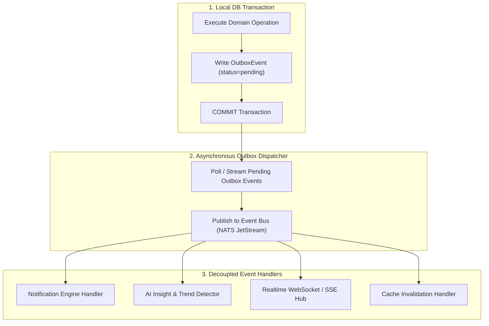

# KinGuard Platform Event Choreography & Outbox Guide

## 1. Event Architecture Overview
KinGuard relies on **Asynchronous Event-Driven Choreography** to decouple bounded domains, eliminate distributed transactions, and coordinate multi-channel notifications and cache invalidations.



---

## 2. Core Domain Event Catalog

| Event Name | Aggregate Type | Trigger Condition | Downstream Actions |
| :--- | :--- | :--- | :--- |
| `care_circle_created` | `Family` | New family circle initialized | Creates default channel, sends welcome push |
| `member_added` | `FamilyMembership` | User joins family circle | Invalids member caches, updates chat room |
| `wellbeing_checkin_submitted` | `WellbeingCheckin` | Parent submits daily check-in | Evaluates trend, alerts coordinator if feeling unwell |
| `medication_taken` | `MedicationAdherence` | Parent confirms dose taken | Invalidates `parent.home`, `coordinator.home`, clears reminder |
| `medication_missed` | `MedicationAdherence` | Dose not taken within window | Escalates notification to coordinator |
| `guardian_moment_generated` | `AIInsight` | Trend engine detects health shift | Delivers push notification, updates home moment card |
| `health.observation.ingested` | `HealthObservation` | Wearable or lab data received | Feeds baseline computation, triggers trend anomaly check |
| `document_extraction_completed` | `HealthDocument` | OCR worker extracts lab data | Requests human clinical review |

---

## 3. Transactional Outbox Pattern
To prevent dual-write inconsistencies, all external side-effects (publishing to NATS, sending FCM notifications, calling FHIR) are recorded as `OutboxEvent` records inside the primary database transaction:

```python
outbox_event = OutboxEvent(
    id=uuid.uuid4(),
    event_type="MedicationTaken",
    aggregate_type="MedicationAdherenceEvent",
    aggregate_id=adherence_id,
    family_id=family_id,
    payload={"adherence_id": str(adherence_id), "status": "taken"},
    status="pending",
    attempt_count=0,
    available_at=datetime.now(timezone.utc)
)
session.add(outbox_event)
await session.commit()
```

### Exponential Backoff & Retry Strategy:
- Max retry attempts: 5.
- Retry interval: $2^{\text{attempt}} \times 10\text{s} + \text{jitter}$.
- If retries are exhausted, the event is marked `dead_letter` and an operational alert is emitted.

---

## 4. Distributed Sagas & Compensating Actions
When downstream external integrations fail permanently (e.g. unresolvable FHIR patient conflict or unrecoverable FileNest error), the [`CompensatingActionEngine`](file:///d:/Kalyan/kinguard-platform/platform/kinguard-backend/app/core/transaction_boundary/saga.py) executes automated compensation:
1. Reverts local entity status to `sync_failed`.
2. Emits audit trail event: `audit.compensating_action_executed`.
3. Marks outbox record as `compensated_failure`.

---

## 5. Realtime Projection Invalidation
When domain events are processed, the [`ProjectionInvalidationRegistry`](file:///d:/Kalyan/kinguard-platform/platform/kinguard-backend/app/infrastructure/realtime/projections.py) determines which client cache keys are dirty and emits targeted invalidation messages over WebSockets and SSE:

```json
{
  "event_id": "evt-7712",
  "domain_event": "medication_taken",
  "family_id": "09eee0ec-a785-4945-8943-9518a5c541f4",
  "affected_projections": ["home", "medications", "timeline", "notifications"],
  "action": "invalidate",
  "timestamp": "2026-08-24T07:45:00Z"
}
```
Clients refresh only the affected query hooks without polling full pages.
