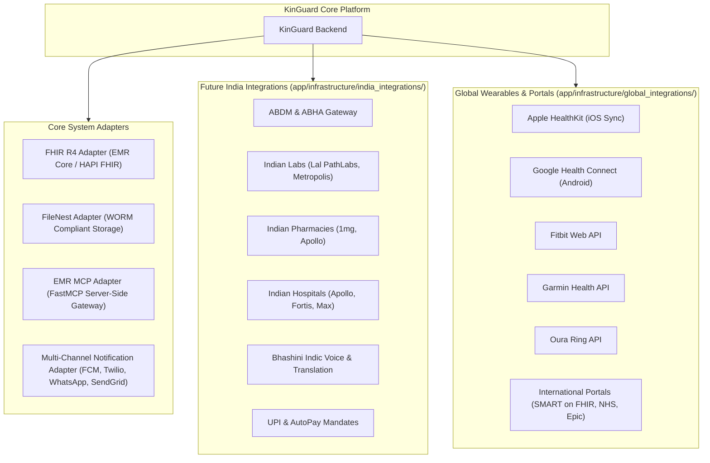

# KinGuard Platform External & Global Integrations Guide

## 1. Core Integration Adapters



---

## 2. India-Specific Integrations Layer

### A. ABDM & ABHA Identity & Consent Manager
- **Protocols**: [`IABHAService`](file:///d:/Kalyan/kinguard-platform/platform/kinguard-backend/app/infrastructure/india_integrations/abdm.py), [`IABDMHealthDataExchange`](file:///d:/Kalyan/kinguard-platform/platform/kinguard-backend/app/infrastructure/india_integrations/abdm.py).
- **Features**: Aadhaar OTP verification, creation of ABHA numbers and addresses (`user@abdm`), consent artefact management, and linking Care Contexts.

### B. Indian Diagnostic Labs
- **Protocol**: [`IIndianLabAdapter`](file:///d:/Kalyan/kinguard-platform/platform/kinguard-backend/app/infrastructure/india_integrations/labs.py).
- **Target Providers**: Dr Lal PathLabs, Metropolis Healthcare, Agilus Diagnostics (SRL), Thyrocare.
- **Features**: Pincode serviceability check, phlebotomist home collection booking, and report ingestion normalized to LOINC.

### C. Indian Pharmacies & E-Prescriptions
- **Protocol**: [`IIndianPharmacyAdapter`](file:///d:/Kalyan/kinguard-platform/platform/kinguard-backend/app/infrastructure/india_integrations/pharmacy.py).
- **Target Providers**: Tata 1mg, Apollo Pharmacy, Netmeds, PharmEasy.
- **Features**: Prescription validation, pincode stock availability, and automated medicine reorders.

### D. Indian Hospitals & Consultations
- **Protocol**: [`IIndianHospitalAdapter`](file:///d:/Kalyan/kinguard-platform/platform/kinguard-backend/app/infrastructure/india_integrations/hospitals.py).
- **Target Providers**: Apollo Hospitals, Fortis Healthcare, Max Healthcare, Manipal Hospitals.

### E. WhatsApp Healthcare Communication
- **Protocol**: [`IWhatsAppHealthcareAdapter`](file:///d:/Kalyan/kinguard-platform/platform/kinguard-backend/app/infrastructure/india_integrations/whatsapp.py).
- **Features**: Interactive quick-reply medication reminders (*"Taken Dose"* / *"Snooze 30m"*), daily wellbeing check-ins, and incoming voice note processing.

### F. Indian Languages & Bhashini Voice
- **Protocol**: [`IIndianLanguageService`](file:///d:/Kalyan/kinguard-platform/platform/kinguard-backend/app/infrastructure/india_integrations/localization.py).
- **Languages Supported**: Hindi (`hi`), Telugu (`te`), Tamil (`ta`), Kannada (`kn`), Bengali (`bn`), Marathi (`mr`), Gujarati (`gu`), Malayalam (`ml`), Punjabi (`pa`), Indian English (`en`).

### G. UPI & AutoPay Recurring Billing
- **Protocol**: [`IUPIPaymentGateway`](file:///d:/Kalyan/kinguard-platform/platform/kinguard-backend/app/infrastructure/india_integrations/payments.py).
- **Features**: Dynamic Bharat QR generation, mobile UPI app intents (`upi://pay`), and recurring monthly UPI AutoPay mandates for subscription billing.

---

## 3. Global Wearables & Health Ingestion Pipeline

### A. Core Architectural Principle: Universal Ingestion Pipeline
All wearable feeds (Apple Health, Fitbit, Google Health Connect, Garmin, Oura, SMART on FHIR) flow through [`NormalizedObservationPipeline`](file:///d:/Kalyan/kinguard-platform/platform/kinguard-backend/app/infrastructure/global_integrations/pipeline.py), which normalizes raw vendor telemetry into canonical LOINC metrics without special-case application logic:

```python
# Unified Ingestion Flow
normalized_obs = ObservationNormalizer.normalize_apple_health_sample(subject_id, sample)
await pipeline.ingest_observations(family_id, subject_id, [normalized_obs])
```

### B. Standard LOINC Code Registry
- **Heart Rate**: `8867-4` (`bpm`)
- **Resting Heart Rate**: `40443-4` (`bpm`)
- **Heart Rate Variability (HRV)**: `80404-7` (`ms`)
- **Oxygen Saturation (SpO2)**: `2708-6` (`%`)
- **Systolic Blood Pressure**: `8480-6` (`mmHg`)
- **Diastolic Blood Pressure**: `8462-4` (`mmHg`)
- **Body Temperature**: `8310-5` (`degC`)
- **Daily Step Count**: `55423-8` (`steps`)
- **Total Sleep Duration**: `93832-4` (`minutes`)
- **Deep Sleep Duration**: `93831-6` (`minutes`)
- **Respiratory Rate**: `9279-1` (`breaths/min`)
