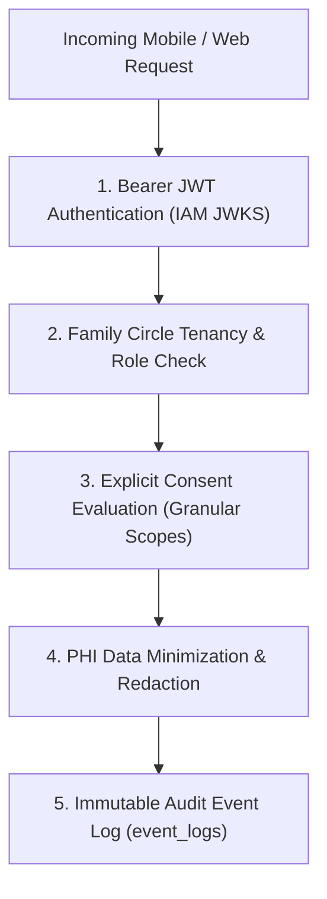

# KinGuardian Platform Security Architecture

## 1. Zero-Trust Security Posture
KinGuardian operates under a zero-trust model: every API request is authenticated, authorized, tenant-checked, and logged to an immutable audit trail.



---

## 2. Authentication & IAM Integration
- **JWT Verification**: Validates RS256 / HS256 signatures against the IAM JWKS endpoint (`IAM_JWKS_URL`).
- **Token Claims**: Validates `sub` (IAM Subject ID), `user_id`, `email`, and token expiration (`exp`).
- **Revocation**: Blacklisted tokens and expired sessions are checked in Redis.

---

## 3. RBAC & Granular Consent Engine
KinGuardian decouples **Identity Roles** from **Clinical Data Access Rights**:

### A. Role Hierarchy
- `primary_coordinator`: Circle creator, full administrative control.
- `coordinator`: Adult child / primary caregiver, full care management capabilities.
- `parent`: Aging parent / care subject, owner of health data and consents.
- `viewer` / `member`: Family member, read-only view of authorized timeline updates.

### B. Explicit Consent Contracts (`ConsentEntity`)
Access to sensitive clinical data (vitals, medications, medical records) requires an active `Consent` record:
```json
{
  "grantor_profile_id": "parent-id",
  "grantee_profile_id": "coordinator-id",
  "subject_id": "subject-id",
  "consent_type": "clinical_read",
  "scope": {
    "vitals": true,
    "medications": true,
    "appointments": true,
    "documents": true
  },
  "status": "active"
}
```

---

## 4. Security Boundaries

### A. FHIR Security Boundary
Mobile clients **never** access the internal FHIR server directly.
- All requests flow: `Mobile -> KinGuardian API -> Consent Check -> FHIR Adapter -> FHIR Server`.
- Server injects machine-to-machine (M2M) credentials.
- Direct client bypass attempts are rejected with **HTTP 403 Forbidden**.

### B. File Storage Security Boundary
Mobile clients **never** receive master FileNest / S3 credentials.
- All uploads and downloads use short-lived (max 15-minute TTL) HMAC-SHA256 signed URLs.
- Strict MIME type whitelisting permits only safe documents (`.pdf`, `.png`, `.jpeg`, `.webp`, `.heic`).
- Executable files (`.exe`, `.sh`) and quarantined documents are rejected.

### C. AI & Model Security Boundary
- Zero model-provider API keys (OpenAI / Gemini / Claude) are exposed to clients.
- All user text, OCR transcripts, and voice notes are wrapped in `<untrusted_user_text>` tags to neutralize prompt injection attacks.
- Tool authorizations are verified deterministically by [`ExternalToolAuthorizationGatekeeper`](file:///d:/Kalyan/kinguardian-platform/platform/kinguardian-backend/app/domains/agent/safety.py) strictly outside the LLM.

---

## 5. PHI Data Minimization & Redaction
- In transit, all clinical parameters are masked when accessed by users lacking explicit consent.
- In AI prompts, patient identifiers are pseudonymized (e.g. `Subject-8910`) and unnecessary demographic fields are stripped.

---

## 6. Immutable Audit Logging & Legal Holds
- All consent updates, clinical record accesses, and document views emit immutable `EventLog` records.
- Supports `legal_hold` flags preventing data purging during active investigations.
